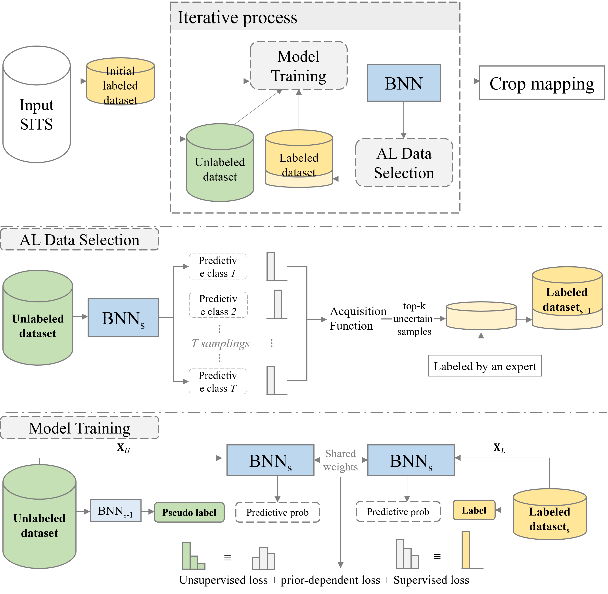

# Bayesian Semi-supervised Active Learning

PyTorch implementation of  ["A new Bayesian semi-supervised active learning framework for large-scale crop mapping using Sentinel-2 imagery"]()




**Abstract:** Crop mapping provides information on crop types and cropland spatial distribution. Therefore, accurate and timely crop mapping serves as the fundamental step to higher-level agricultural applications, such as crop yield prediction. Recently, deep learning classification models have been explored for crop mapping. However, most existing methods are still limited in practical applications for large-scale crop mapping due to the great need for representative labeled data that cover diverse geographical conditions. To address this issue, we proposed a novel deep active learning method, named Bayesian Semi-Supervised Active Learning (BSSAL), using time-series Sentinel-2 imagery for large-scale crop mapping. This framework consists of three parts: 1) a Bayesian neural network (BNN) for crop classification, 2) a Semi-Supervised task to leverage massive satellite imagery without crop type information, and 3) an active learning strategy to select the most informative samples to be labeled. The proposed framework was validated on five crop classes over six sites with different geographical conditions across the U.S. in testing years 2019-2021. The BSSAL framework produced a mean OA of 98.69% in the end-of-season experiment and significantly outperformed other comparison methods. Moreover, it achieved an average OA of 97.00% with in-season satellite imagery from the day of year 140 (early April) to 200 (mid-July) and greatly improved the timeliness of crop mapping. Furthermore, the BSSAL framework had the best performance in all study sites, showing the robustness of the global model on local testing. By monitoring the accuracy of each crop type along with the number of samples selected, the results showed the effectiveness of the proposed active data query strategy to random choice. Overall, this study provided a robust framework for large-scale crop mapping with less labeling budget and higher classification accuracy.

## Requirements

* Pytorch 3.8.12, PyTorch 1.11.0, and more in `environment.yml`

## Usage

Setup conda environment and activate

```
conda env create -f environment.yml
conda activate py38
```

Set `DATAPATH` in `train.py` to your data path. 

Example: train bssal

```shell
python train.py --labeled train_2019 --unlabeled test_2019_mini ssal
```

train al with MLP & Entropy selection function

```shell
python train.py --labeled train_2019 --unlabeled test_2019_mini --model MLP al
```

train ssl with pseudo label threshold = 0.5

```shell
python train.py --labeled train_2019 --unlabeled test_2019_mini ssl --pseudo_threshold 0.5
```

## Reference

In case you find SITS-MoCo or the code useful, please consider citing our paper using the following BibTex entry:

```
xxx
```

## Credits

- The Sentinel-2 imagery were accessed from the [GEE platform (Sentinel-2 MSI, Level-2A)](https://developers.google.com/earth-engine/datasets/catalog/COPERNICUS_S2_SR); and the annotations used in the dataset from the [Cropland Data Layer (CDL) by USDA NASS](https://www.nass.usda.gov/Research_and_Science/Cropland/SARS1a.php), which were also accessed from the [GEE platform (USDA NASS Cropland Data Layer)](https://developers.google.com/earth-engine/datasets/catalog/USDA_NASS_CDL)
